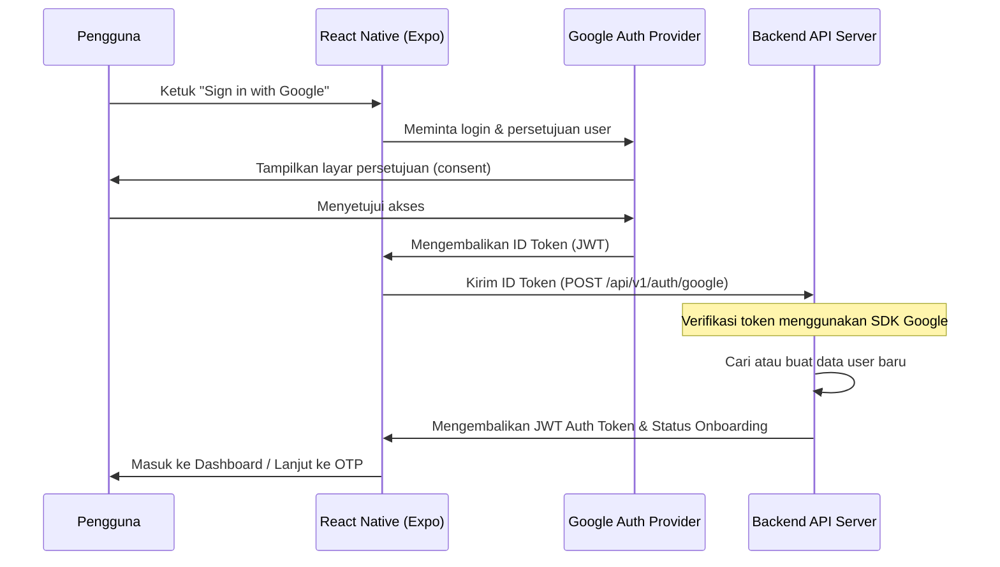

# Panduan Integrasi Google Authentication (Frontend & Backend)

Dokumen ini menjelaskan alur integrasi Google Sign-In antara aplikasi mobile React Native (Expo) dan server Backend, serta langkah-langkah konfigurasi Google Developer Console.

---

## 1. Alur Kerja OAuth 2.0 (Token-Based)

Integrasi Google Auth menggunakan alur **ID Token Verification**. Alur ini direkomendasikan untuk aplikasi mobile karena lebih aman dan mudah diimplementasikan:



---

## 2. Persiapan Google Cloud Console (Developer)

Untuk mendukung Google Sign-In di perangkat mobile (Android & iOS), Anda **harus** membuat tiga Client ID terpisah di Google Cloud Console.

### Langkah-Langkah Pembuatan Project
1. Buka [Google Cloud Console](https://console.cloud.google.com/).
2. Buat proyek baru atau pilih proyek yang sudah ada.
3. Konfigurasikan **OAuth Consent Screen** (Pilih tipe *External*, isi informasi dasar, dan tambahkan scope `email` dan `profile`).

### Pembuatan Kredensial (Client IDs)

Anda harus membuat 3 Client ID:

1. **Web Client ID (Server Client ID)**
   - Tipe Aplikasi: **Web Application**
   - Nama: `Web Client ID` (atau `Backend Client ID`)
   - *Penting*: ID ini yang akan digunakan oleh backend untuk memverifikasi token dari aplikasi mobile. Berikan nilai ID ini ke frontend sebagai `webClientId`.
   
2. **Android Client ID**
   - Tipe Aplikasi: **Android**
   - Nama: `Android Mobile Client`
   - **Package Name**: Harus sama dengan `expo.android.package` di `app.json` (misalnya: `com.zaidmobileapp`).
   - **SHA-1 Fingerprint**: Dapatkan SHA-1 dari key development (debug.keystore) atau Google Play Console (production).
     * *Debug Keystore SHA-1*: Jalankan perintah ini di direktori project:
       ```bash
       keytool -list -v -keystore ~/.android/debug.keystore -alias androiddebugkey -storepass android -keypass android
       ```

3. **iOS Client ID**
   - Tipe Aplikasi: **iOS**
   - Nama: `iOS Mobile Client`
   - **Bundle ID**: Harus sama dengan `expo.ios.bundleIdentifier` di `app.json` (misalnya: `com.zaidmobileapp`).

---

## 3. Implementasi Backend (Verifikasi ID Token)

Backend menerima **ID Token** dari frontend melalui endpoint `/v1/auth/google`. ID Token adalah JWT yang ditandatangani oleh Google.

### Endpoint Spec
* **URL**: `/v1/auth/google`
* **Method**: `POST`
* **Request Headers**: `Content-Type: application/json`
* **Request Body**:
  ```json
  {
    "id_token": "eyJhbGciOiJSUzI1NiIsImtpZCI6...", // ID Token yang diperoleh dari mobile
    "device": { // (Opsional) Informasi device untuk push notifications / audit
      "platform": "android",
      "device_id": "unique-uuid",
      "device_name": "Samsung Galaxy S21"
    }
  }
  ```

### Logika Verifikasi di Backend (Node.js / Express Example)
Gunakan library resmi Google `google-auth-library` untuk memverifikasi token secara offline (sangat cepat dan aman).

```javascript
const { OAuth2Client } = require('google-auth-library');
// Gunakan Web Client ID yang dibuat di Google Console
const client = new OAuth2Client(process.env.GOOGLE_WEB_CLIENT_ID);

async function verifyGoogleToken(idToken) {
  const ticket = await client.verifyIdToken({
    idToken: idToken,
    // Verifikasi bahwa token ditujukan untuk client ID kita
    audience: process.env.GOOGLE_WEB_CLIENT_ID, 
  });
  const payload = ticket.getPayload();
  
  // Payload berisi data profil user
  return {
    googleId: payload['sub'], // ID unik google user
    email: payload['email'],
    name: payload['name'],
    avatar: payload['picture']
  };
}
```

### Logika Verifikasi di Backend (Bahasa Lain / HTTP Fallback)
Jika tidak menggunakan Node.js, Anda dapat melakukan HTTP GET request ke endpoint tokeninfo Google:
```
GET https://oauth2.googleapis.com/tokeninfo?id_token=<ID_TOKEN_DARI_FRONTEND>
```
Backend harus memeriksa:
1. HTTP status code adalah `200 OK`.
2. Field `aud` di JSON response bernilai sama dengan `GOOGLE_WEB_CLIENT_ID` Anda.
3. Field `exp` (waktu kedaluwarsa) lebih besar dari waktu server saat ini.

### Struktur Response Sukses (200 OK)
Setelah token terverifikasi, backend harus membuat session/JWT token internal dan mengembalikannya ke frontend dengan data onboarding:

```json
{
  "success": true,
  "message": "Login successful",
  "data": {
    "access_token": "backend_jwt_auth_token_here",
    "token_type": "Bearer",
    "expires_in": 3600,
    "user": {
      "id": "user-uuid-in-database",
      "email": "user.email@gmail.com",
      "full_name": "Nama Lengkap User",
      "avatar_url": "https://lh3.googleusercontent.com/a/avatar-url-from-google",
      "status": "active"
    },
    "onboarding": {
      "required": true, // true jika user belum menyelesaikan setup
      "phone_verified": false, // status verifikasi nomor telepon
      "next_step": "phone_input" // "phone_input" | "verify_otp" | "dashboard"
    }
  }
}
```

---

## 4. Implementasi Frontend (Sudah Siap di Aplikasi)

Aplikasi mobile menggunakan plugin `@react-native-google-signin/google-signin` secara opsional. Kode frontend telah dilengkapi dengan mekanisme pendeteksian otomatis dan graceful fallback.

### Konfigurasi Kode
Kredensial dikonfigurasi melalui file `src/services/auth/googleAuth.ts`. Frontend membaca client ID dari environment variable:
`process.env.EXPO_PUBLIC_GOOGLE_WEB_CLIENT_ID` (Web Client ID dari Google Cloud Console).

### Menghubungkan Google Sign-In Baru
Untuk memasang integrasi ini di mobile secara penuh:
1. Jalankan instalasi dependency:
   ```bash
   npm install @react-native-google-signin/google-signin
   ```
2. Tambahkan config plugin di `app.json` (jika menggunakan Expo EAS Build):
   ```json
   "plugins": [
     "@react-native-google-signin/google-signin"
   ]
   ```
3. Set variabel environment `EXPO_PUBLIC_GOOGLE_WEB_CLIENT_ID` di file `.env`.
4. Jalankan `npx expo prebuild` untuk mengintegrasikan library native.

---

## 5. Troubleshooting & Tips Keamanan

1. **Developer SHA-1 Fingerprint Mismatch**:
   Sering terjadi kesalahan saat Google Sign-In mengembalikan `Developer Error` (Code 10) di Android. Pastikan SHA-1 sidik jari keystore debug yang terdaftar di Google Cloud Console sama persis dengan keystore yang digunakan Expo untuk membuild aplikasi.
2. **Audience Check**:
   Backend **wajib** memverifikasi field `aud` (audience) di ID Token. Jika tidak, pihak ketiga dapat mengirimkan ID token dari aplikasi lain dan masuk ke server Anda secara ilegal.
3. **HTTPS Redirect**:
   Untuk integrasi Google Calendar, pastikan redirect URL yang didaftarkan di Google Console adalah HTTPS (misalnya: `https://zaid-assist.my.id/api/v1/integrations/google-calendar/callback`).
